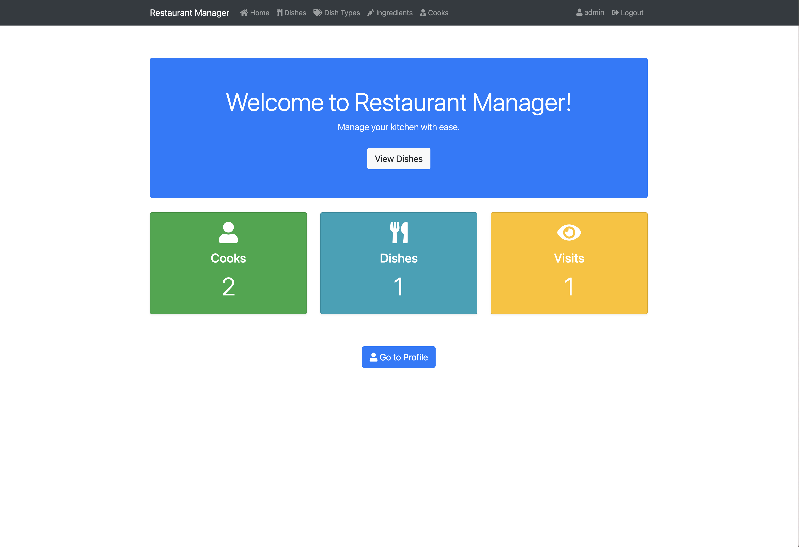

# RestaurantManager

Django project for managing kitchen of the restaurant

## Check it out!

[Restaurant manager deployed to Render]()

## Instalation

```shell
git clone https://github.com/popeye88/RestaurantManager.git
cd RestaurantManager
python3 -m venv venv
source venv/bin/activate
pip install -r requirements.txt
python manage.py runserver
```

## Features

* Authentication functionality for Cook/User
* Managing dishes, ingredients, cooks

## Demo

